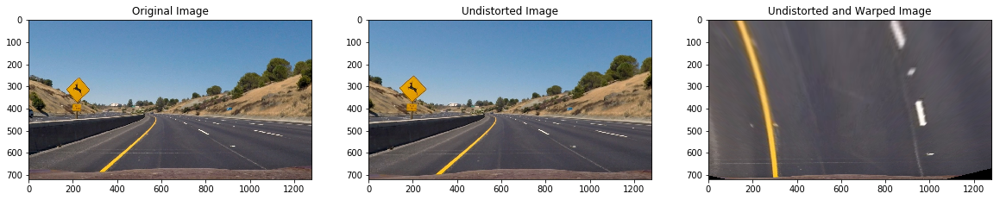
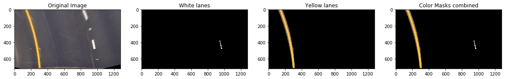
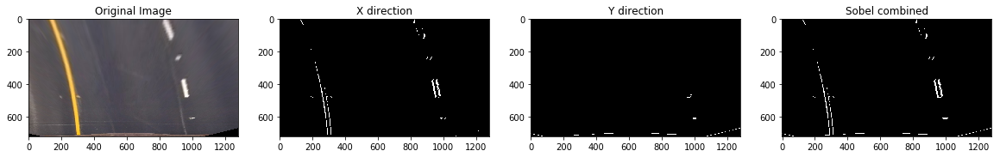
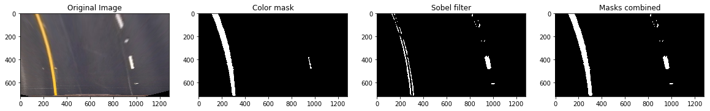
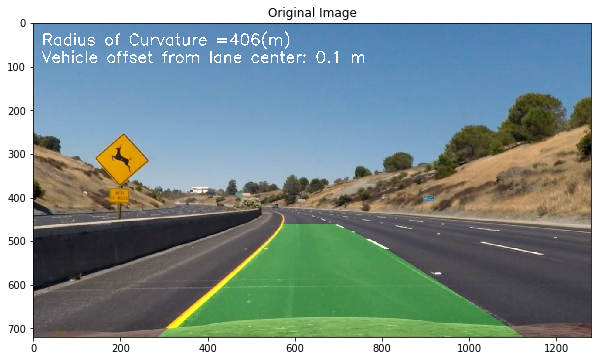

## Advanced Lane Finding

Below I will describe point by point the steps taken in this algorithm to detect the lane lines. 

The Project
---

The goals / steps of this project are the following:

* Compute the camera calibration matrix and distortion coefficients given a set of chessboard images.
* Apply a distortion correction to raw images.
* Use color transforms, gradients, etc., to create a thresholded binary image.
* Apply a perspective transform to rectify binary image ("birds-eye view").
* Detect lane pixels and fit to find the lane boundary.
* Determine the curvature of the lane and vehicle position with respect to center.
* Warp the detected lane boundaries back onto the original image.
* Output visual display of the lane boundaries and numerical estimation of lane curvature and vehicle position.

### Camera Calibaration
Camera calibration is done by the script `calibrate_camera.py` located in the algorithms folder. Below an example of a chessboard image used for calibration and the undistorted version.

### Apply a distortion correction and perspective transform
Next, I used the camera calibration values (that were saved to the file calibrate_camera.p) to distort the raw lane lines images and at the same time I've warped them as well. The code for the distortion and the warping is included in the file `image_transformations.py` in seperate functions.

### Create color mask 
To determine the lane lines I've used two parallel pipelines: a color mask and an sobel filter. The color mask is splitted in a yellow and a white mask. Both are applied to the warped image.

### Add Sobel filter
Next to the color mask I've used a Sobel filter on the x-direction and y-direction to detect lane lines.

### Combine color mask and sobel filter to create binary mask
After applying the color mask and the sobel filter in parallel I've combined both binary images to create a single binary mask on the warped image.

### Detect lane pixels 

### Use window to detect lane lines in steps

### Determine curve and position of car
To determine the curve of the lane lines I've followed the steps described in the lessons. The curve and relative position are displayed in the top left of each image (or frame). 

#### Draw lines on original image (undistorted)

### Video pipeline 
The complete video pipeline is implemented in the 'Process video' Notebook and the output of the project video can be found in the output directory (project_video_output.mp4).

### Discussion
This alogrithm has problems identifying the lane lines in the challenge videos, because of the contrast and the fact that the lane lines are not as clearly visible as in the project video. Possible improvements:

* Remove outliers before fitting the polynomials.
* Implement region of interest (ROI)
* Tweak thresholds
* Compare frame with previous frame(s) to reduce sudden changes
